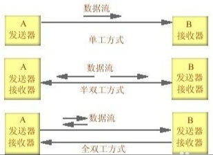
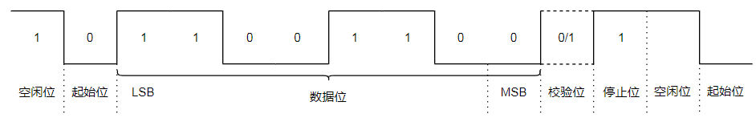

## 简介
通用异步收发传输器（Universal Asynchronous Receiver/Transmitter，通常称为 UART）是一种**异步收发传输器**，是电脑硬件的一部分，将数据通过串列通信进行传输。

## 协议层
Uart 是一种通用的**串行**、异步通信总线，该总线有两条数据线，可以实现**全双工**的发送与接收。
### 串行与并行

**并行传输**：并行传输指的是数据以成组的方式，在多条并行信道上同时进行传输，是在传输中有多个数据位同时在设备之间进行的传输。

**串行传输**：使用一条数据线，将数据一位一位地依次传输，每一位数据占据一个固定的时间长度。只需要少数几条线就可以在系统间交换信息，特别适用于计算机与计算机、外设之间的远距离通信。

### 单工、半双工和全双工

   **单工**：简单的说就是一方只能发信息，另一方则只能收信息，通信是单向的。
   **半双工**：比单工先进一点，就是双方都能发信息，但同一时间则只能一方发信息。
   **全双工**：比半双工再先进一点，就是双方不仅都能发信息，而且能够同时发送。
### 波特率

波特率的单位是bps，全称是bit per second，意为每秒钟传输的bit数量。
波特率9600bps，代表每秒钟传输bit的数量为9600，那么传输1bit数据的时间就是1/9600=104us，波特率115200bps，代表传输1bit数据的时间是8us。
### UART 帧格式

**其中各位的含义如下：**
- **起始位**：发送1位逻辑0（低电平），开始传输数据。
- **数据位**：可以是5~8位的数据，先发低位，再发高位，一般常见的就是8位（1个字节），其他的如7位的ASCII码。
- **校验位**：奇偶校验，将数据位加上校验位，1的位数为偶数（偶校验），1的位数4为奇数（奇校验）。数据位加上这一位后，使得“1”的位数应为偶数(偶校验)或奇数(奇校验)，以此来校验数据传送的正确性。校验位其实是调整个数，以下是奇偶校验两种方式：

	奇校验（odd parity）：如果数据位中“1”的数目是偶数，则校验位为“1”，如果“1”的数目是奇数，校验位为“0”。
	偶校验（even parity）：如果数据为中“1”的数目是偶数，则校验位为“0”，如果为奇数，校验位为“1”。
    在代码设计中我们采用一位异或，将每两位相邻数据位异或后得到一位数据，再根据设置的奇校验偶校验来判断校验位的值。
- **停止位**：停止位是数据传输结束的标志，可以是1/1.5/2位的逻辑1（高电平）。
- **空闲位**：空闲时数据线为高电平状态，代表无数据传输。

如果我们传输数据0X33（00110011），那么对应的波形就是如下这样，因为是LSB在前，所以8位数据依次是11001100。

## 物理层

### 接口类型、电平标准
串口电平标准：

TTL 电平的串口（3.3 v)
RS 232 电平的串口（+3~+15 v 为低电平，-5~-15 v 为高电平）

串口按电气标准分包括：
• RS-232-C: TXD/RXD/GND、15 m/9600 bps （全双工）
• RS-422：TX+/TX-/RX+/RX-/GND （全双工，差分信号）
• RS 485: A/B/G 、1200 米/9600 bps （半双工，差模信号）